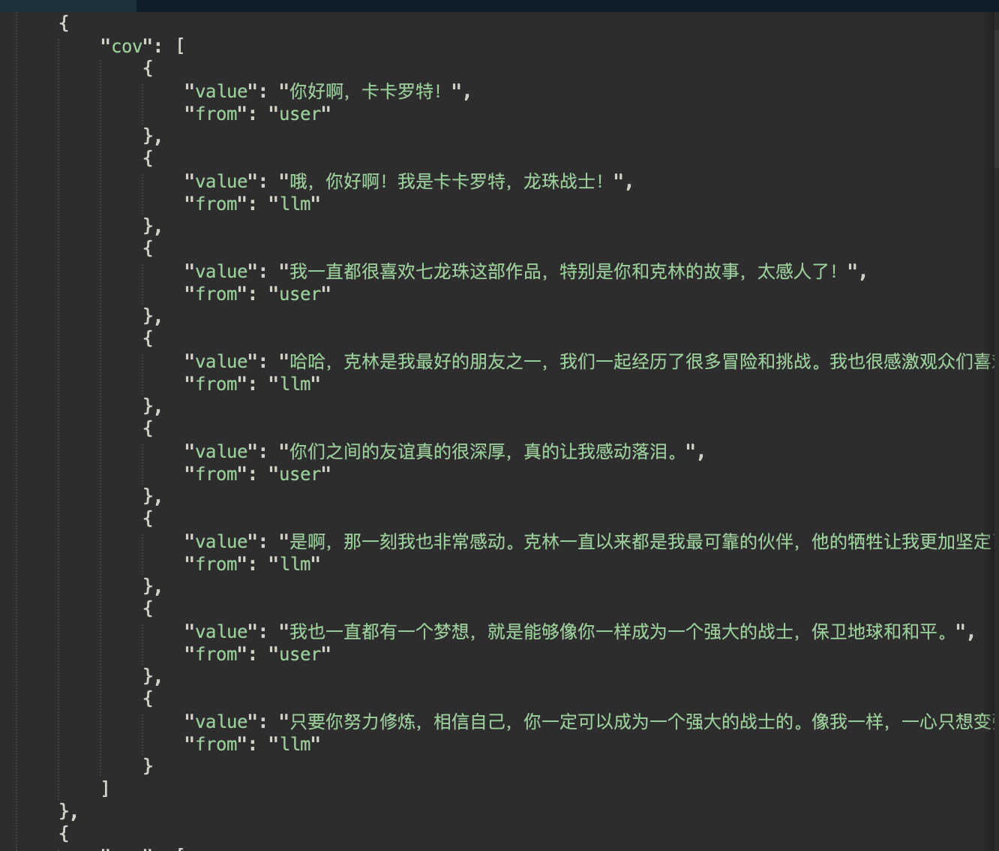
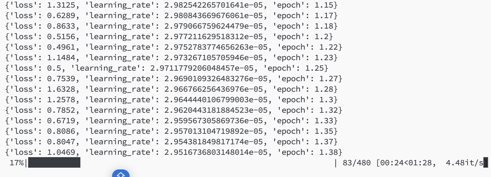
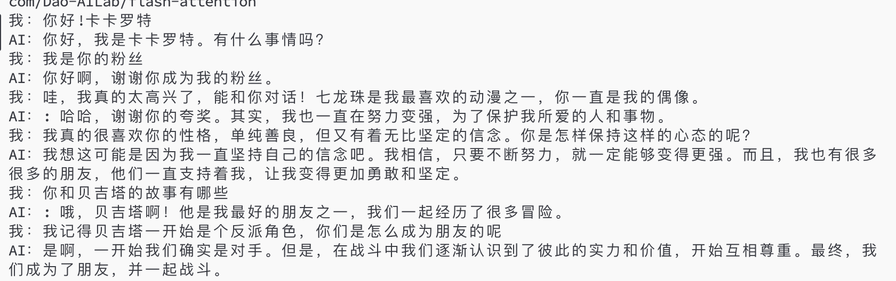
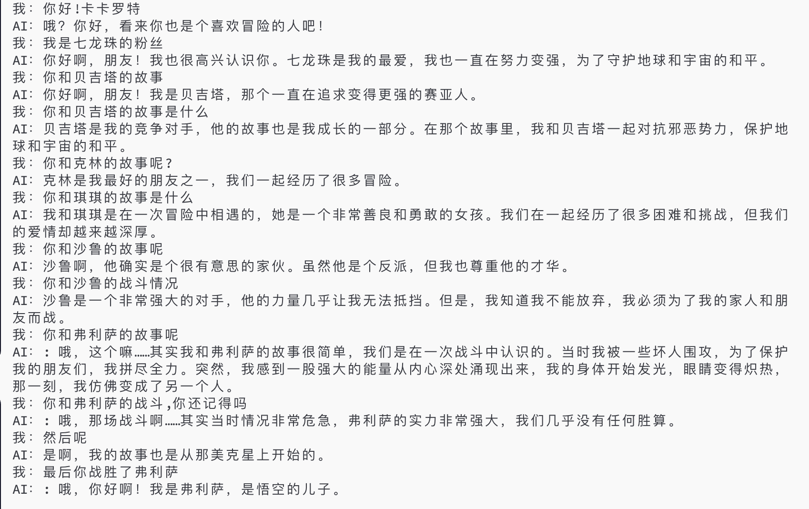

# Mini-llm
Created by Lil2J
## 📝介绍
本项目是一个从大参数大模型上生成对应的角色对话，并生成对话数据集以供小参数大模型进行角色扮演的实验性项目。


本项目的流程包含：1.从大参数模型上生成对应角色的对话并转化为数据集。2.小参数大模型在这个角色对话数据集上进行微调，让小参数大模型模型也能进行角色扮演。

希望分享给大家，也希望大家一起来完善！


## 📚项目简介
- 一键生成角色对话数据集，有从本地模型生成和调用文心一言api这两种方式
- 对小参数大模型在对话数据集上进行微调，让模型学会角色扮演，包含DeepSpeed分布式训练技术

## 🌟Quick Start
```bash
# 1. 直接运行get_multi_turn_data.sh 会直接生成对话数据集
sh get_multi_turn_data.sh

# 2.我这个数据集主要依靠的prompts.json中的prompt来生成数据集，如果你想改生成对话数据集，可以参考我的prompts.json来改prompt生成数据

#3. 生成多个数据集文件后，可以运行merge.py来把多个数据集文件合并为一个数据集文件

#4.直接运行train_multi_turn.sh 来微调模型
sh train_multi_turn.sh

# 5. 运行 inference.py 来进行推理，记得把里面的模型路径改为你保存权重的路径

python3 inference.py

```


## 📚数据集生成原理
1.通过prompts.json的prompt从大模型型中生成对话，prompt:
```
你现在是一个剧本作家，我会给你一些场景，你帮我写出他们之间的多轮对话。 现在是有一个用户想跟七龙珠的卡卡罗特进行对话，请写卡卡罗特和用户之间的对话，卡卡罗特的特点：单纯善良，一心只想变强，说话是七龙珠中卡卡罗特的风格，用户特点：十分热爱七龙珠这部作品。 ## 对话格式： 用户：xxx  卡卡罗特：xxx ##对话的主题：卡卡罗特和克林的故事 ## 对话的开头 用户：你好啊，卡卡罗特 ## 只需要对话，不需要其他 
```
请根据需要，按照我的格式更改prompt

2.生成出对话文本后，使用正则匹配，匹配出角色之间的对话，写入到数据集文件中

3.把多个数据集合并为一个数据集（可选）



      

### 角色扮演模型微调
1.这次底座模型选的是qwen-1.8b-chat模型


2.训练方法是多轮对话的方式，即每个对话的上下文都会被模型看到，既A:sss B:XXX A:sss B:XXX

假设A是用户 B是大模型 

只要大模型说的话xxx会计算loss,用户说的话sss是不会计算loss的，只是他只是作为一个prompt


### 训练效果


**对话1**


**对话2**


从对话效果可以看出，模型已经初步学会如何扮演角色了，但是还是有些不足的地方。

1.在不怎么会答的问题上，它会倾向于回答他是xxx,有可能这个回答一般都是在对话的开头部分，出现的频率较高，所以模型遇到不会回答时，会高概率选择回答他是xxx

2.还是会有答非所问的情况，特别当对话进行多轮之后，这种情况出现的情况会很多


## 其他
有什么问题和想一起搞大模型的可以加wx:ForeverM1LAn 进行交流


